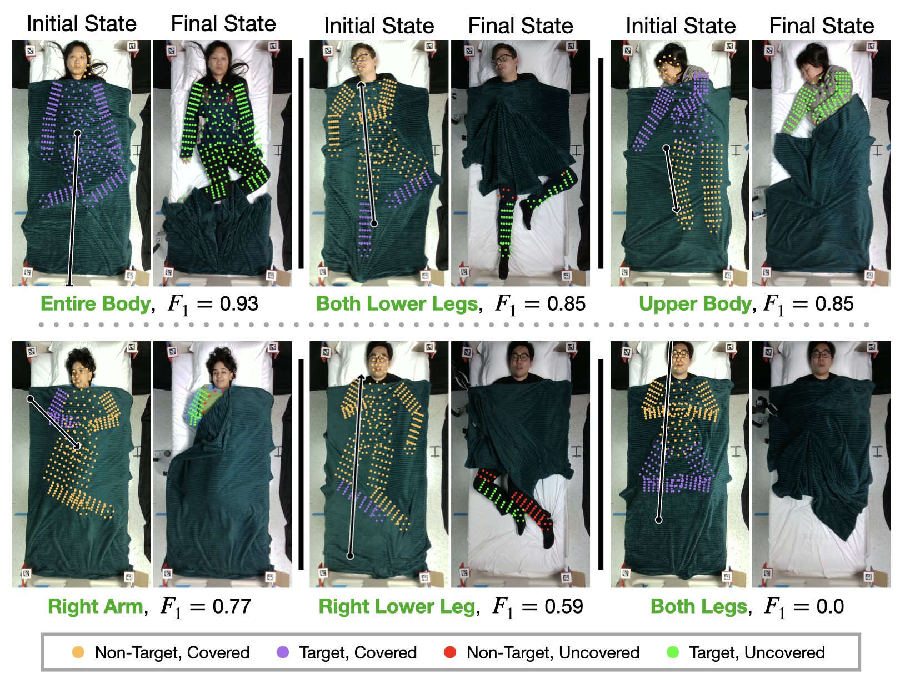

# Robust Body Exposure (RoBE): A Graph-based Dynamics Modeling Approach to Manipulating Blankets over People

**[Kavya Puthuveetil](https://kpputhuveetil.github.io/)$$^1$$, Sasha Wald$$^1$$, Atharva Pusalkar$$^1$$, Pratyusha Karnati$$^2$$, [Zackory Erickson](https://zackory.com/)$$^1$$**

$$^1$$ Carnegie Mellon, $$^2$$ Google X: Everyday Robots

<div>
  <div style="position:relative;padding-top:56.25%;">
    <iframe src="https://www.youtube.com/embed/Sv9BRw6fsR0" frameborder="0" title="YouTube video player" allow="accelerometer; autoplay; clipboard-write; encrypted-media; gyroscope; picture-in-picture" allowfullscreen
      style="position:absolute;top:0;left:0;width:100%;height:100%;"></iframe>
  </div>
</div>

## Abstract
Robotic caregivers could potentially improve the quality of life of many who require physical assistance. However, in order to assist individuals who are lying in bed, robots must be capable of dealing with a significant obstacle: the blanket or sheet that will almost always cover the person's body. We propose a method for targeted bedding manipulation over people lying supine in bed where we first learn a model of the cloth's dynamics. Then, we optimize over this model to uncover a given target limb using information about human body shape and pose that only needs to be provided at run-time. We show how this approach enables greater robustness to variation relative to geometric and reinforcement learning baselines via a number of generalization evaluations in simulation and in the real world. We further evaluate our approach in a human study with 12 participants where we demonstrate that a mobile manipulator can adapt to real variation in human body shape, size, pose, and blanket configuration to uncover target body parts without exposing the rest of the body. Source code and supplementary materials are available online$.


<!-- ### [ArXiv Link]() [ADD LINK] -->


## Citation
##### ["Robust Body Exposure (RoBE): A Graph-based Dynamics Modeling Approach to Manipulating Blankets over People"](https://arxiv.org/abs/2304.04822)
K. Puthuveetil, Sasha Wald, Atharva Pusalkar, Pratyusha Karnati, and Z. Erickson, “Robust Body Exposure (RoBE): A Graph-based Dynamics Modeling Approach to Manipulating Blankets over People,” 2023.

##### Bibtex
```
@misc{puthuveetil2023robust,
      title={Bodies Uncovered: Learning to Manipulate Real Blankets Around People via Physics Simulations}, 
      author={Kavya Puthuveetil and Sasha Wald and Atharva Pusalkar and Pratyusha Karnati and Zackory Erickson},
      year={2023},
      eprint={2304.04822}, 
      archivePrefix={arXiv},
      primaryClass={cs.RO}
}
```


# Paper Summary
<!-- **You can find additional content the accompanies the paper here: [Supplementary Material](./supplementary-material.html)** -->
The core findings of the work are detailed in the paper and can be understood independent of the content on this page. The following material is intended to summarize and expand on the methodology and results presented in the paper. 


The above figure shows an overview of our approach: A) Starting with a human laying in a hospital bed, we take an observation of their pose, from which we generate a set of body points $$\chi$$. B) After covering the human with a blanket, we capture a point cloud of the initial cloth and process it for composition of a graph $$G(V, E)$$. C) We optimize over the dynamics model using CMA-ES, predicting the displacement of the cloth $$\Delta \hat{V}$$ given the input graph $$G$$ and a proposed action $$\hat{\bm{a}}$$ at every iteration. The objective function maximized during optimization is a measure of how well the final cloth state $$V_f = V + \Delta \hat{V}$$ produced by an action $$\hat{\bm{a}}$$ uncovered a given target limb. D) Once termination criteria are met, we select the best action $$a$$ from the set of proposed action $$\hat{a}$$ and generate an initial prediction of performance before executing the action in the real world.


## Preparing a Raw Point Cloud for Composition of a Graph
<!-- Referenced on Page 3, Section III-B of the paper -->


We compose a graph $$G = (V, E)$$, where the nodes $$V$$ correspond to points in a processed cloth point cloud $$P'$$. To compute $$P'$$ from  a given raw cloth point cloud $$P$$, we first rotate blanket points that hang over the side of the bed up to the bed plane. Rotating overhanging points allows us to more accurately retain the full geometry of the blanket in the graph, which only encodes the 2D position of any particular cloth point.

Given an overhanging point $$\boldsymbol{p}$$ on the raw cloth point cloud $$P$$, defined by whether the point's position along the $$z$$-axis is below the top of the bed, $$\boldsymbol{p} \in P: p_z < 0.575$$, we apply the following function to rotate the point to the 2D bed plane:

$$H(\boldsymbol{p}) = \begin{cases} p_x > 0 & T_R^{-1} R_{R} T_R \boldsymbol{p} \\ p_x < 0 & T_L^{-1} R_{L} T_L \boldsymbol{p} \end{cases}$$

where $$T_R$$ and $$T_L$$ are translation matrices representing the translation between the axes along the right ([0.44, 0, 0.58]) and left ([-0.44, 0, 0.58]) edges of the bed relative to the origin of the world (center of the bed), and where $$R_R$$ and $$R_L$$ are 90 and -90 degree rotation matrices around an axis along the length of the bed that passes through its center ($$y$$-axis).

After rotating the overhanging cloth points, we downsample the point cloud using a 5~cm centroid voxel grid filter [[1]](https://towardsdatascience.com/how-to-automate-lidar-point-cloud-processing-with-python-a027454a536c),[[2]](https://autowarefoundation.gitlab.io/autoware.auto/AutowareAuto/voxel-grid-filter-design.html). Lastly, we project all of the cloth points to the 2D bed plane, yielding the processed point cloud $$P'$$.

## Dynamics Model Training

<!-- ## Performance using Dynamics Models Trained on Datasets of Various Size -->
<!-- Referenced on Page 3, Section III-B, of the paper -->

We train a dynamics model $$F(G, \boldsymbol{a}) = \Delta \hat{V}$$, based on the Graph Network-based Simulators (GNS) architecture [[3]](https://arxiv.org/abs/2002.09405), [[4]](https://arxiv.org/abs/2105.10389), that given an input graph $$G$$ that represents a cloth's initial state and a proposed action $$\boldsymbol{a}$$, predicts the displacement of the cloth $$\Delta\hat{V}$$ after execution of a cloth manipulation trajectory. We train our models over 250 epochs using the Adam optimizer with a mean squared error loss function, batch size of 100, and learning rate of 1e-4.


We train six dynamics models on datasets containing 100, 500, 1000, 5000, 7500, and 10,000 input graphs, respectively. The F-scores achieved by each model when used for control are shown in the above figure. Performance saturates once the number of training samples is greater than 5000. All evaluations are conducted using the dynamics model trained on 10,000 input graphs.

<!-- ## Determining Covered Body Parts -->


## Optimizing Over Dynamics Models
<!-- Referenced on Page 4, Section III-D, of the paper -->
Following training, we use our dynamics models to predict how the state of a cloth will change when manipulated using a proposed action. We use covariance matrix adaptation evolution strategy (CMA-ES) [[5]](https://github.com/CMA-ES/pycma), to optimize over our objective funtion $$O(\chi, V_f, \bm{a})$$ (described in the paper), which allows us to identify optimal bedding manipulation trajectories to uncover people in bed in real time. We allow CMA-ES to optimize over the action space for 38 iterations using a population size of 8 (304 total function evaluations), or until $$O(\chi, V_f, \bm{a}) \geq 95$$.

Optimization performance by CMA-ES can be sensitive to the initialization provided. To combat this issue, we modify the initialization based on the target limb that we are aiming to uncover. We run CMA-ES with a step-size of $$\sigma = 0.2$$


## Evaluations

### Baselines Evaluated
#### Geometric Baseline
<!-- Referenced on Page 6, Section IV-B, of the paper -->
This approach is founded on two assumptions that: 1) there exists a geometric relationship between the cloth and human pose that can be leveraged to uncover a blanket from part of the body and, 2) the cloth behaves like paper---pick and place actions can produce straight-line or accordion folds. To compute actions that "fold" the cloth over the body to uncover a target limb, we apply three strategies depending on the target to be uncovered:

##### Arms:
Grasps the edge of the cloth, pulls towards the midline of the body on a path normal to the length of the arm  

##### Lower Body Targets:
Grasps along the midpoint of the target, pulls towards the head on a path parallel to the limb

##### Upper Body and Entire Body:
Grasps between the shoulders, pulls toward the feet on a path that bisects the body. We provide formal definitions of how each strategy computes these pick and place trajectories on the project webpage.

#### Reinforcement Learning

For this baseline, we use proximal policy optimization (PPO), a model-free deep RL method, to train policies to uncover a single target limb as demonstrated in prior work [[5]](https://arxiv.org/abs/2109.04930). We train a single policy for each of the ten target limbs. To run PPO in the real world, we had to go through the expensive process of training a second set of policies for each target limb, this time using a different action space matching the robot's workspace in the real world.


<!-- ### Simulation -->


#### 2D vs. 3D Representations of the Cloth
<!-- Referenced on Page 2, Section III-A of the paper -->

In Sections III-A and III-B, we describe how input graphs to our dynamics models encode the 2D position of the cloth at each node instead of the 3D position, allowing our models to be invariant to changes in depth. To verify that this representation of the cloth does not negatively impact performance relative to a 3D representation, we train a GNN that takes in input graphs that encode the 3D position of a given cloth point at each node. When preparing a given cloth point cloud for composition of a graph, we do not rotate the overhanging points and instead only voxelize the point cloud. The dynamics model is trained identically to that trained on a 2D representation of a cloth. 

Evaluating both models on the training distribution described in Section III-B, we find that the 2D and 3D dynamics models achieve $$F_1 = 0.77\pm0.23$$ and $$F_1 = 0.80\pm0.19$$, respectively. On the combination distribution, both models have identical performance, both achieving $$F_1 = 0.65\pm0.30$$. Ultimately, we see that encoding a 3D representation of the cloth provides no significant improvement in performance despite requiring tedious depth alignment procedures to transfer simulation-trained models to the real world.

### Manikin Study
We compare our approach to baselines in the real world by deploying the robot to uncover target limbs of a medical manikin lying in the hospital bed. In the study, we evaluate all three methods for uncovering each of the seven target limbs on a set of three poses shown in the figure below (3 methods $\times$ 3 poses $\times$ 7 targets = 63 total trials). As we observed in simulation, RoBE outperforms the geometric approach and PPO on average. 


### Human Study

To evaluate the performance of our method in the real world, we run a human study (Carnegie Mellon University IRB Approval under 2022.00000351) with 12 participants (six female) with informed consent. For each participant, we demonstrate ten bedding manipulation trials (120 trials in total across participants). The ten trials are executed in two phases. 


#### Phase 1: Predefined Pose and Target Limb
The first phase consists of three trials where the participant is asked to assume a predefined pose, shown in the leftmost column of the figure below, and the robot attempts to uncover a predefined target body segment. By holding the pose and target constant, we examine the performance of our method given variation in body shape and size alone.


#### Phase 2: Randomized Pose and Target Limb
The remaining seven trials are a part of Phase 2, in which we ask participants to assume any supine pose of their choosing and we randomly select a target body part to uncover. This second phase allows us to evaluate the robustness of our approach to a large set of challenging, unscripted resting poses. In these evaluations, we observed high performance consistent with simulation for most body targets.




